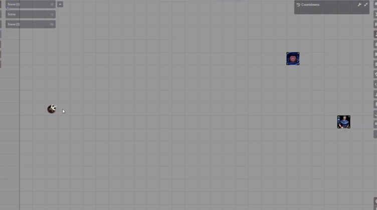
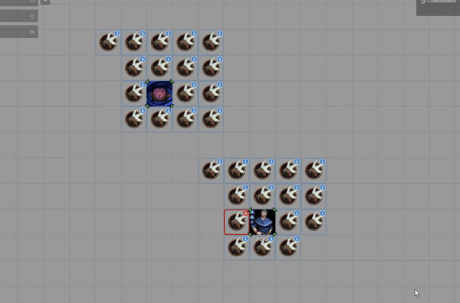

# Daggerheart: Horde

> *One token. Dozens of enemies. Make your players feel the dread.*

A standard horde token is a lie. It says "Giant Mosquitoes × 30" in the corner of a single token, and everyone at the table imagines something terrifying — but the map shows nothing. No sense of scale. No visual threat. When a player kills half of them, the token just gets a number edited. It feels like nothing.

**DH Horde fixes that.**

With one click, your single horde token **explodes into dozens of individual tokens** that spread across the battlefield. Players see the swarm. They feel surrounded. When their attacks land and tokens start disappearing, the map itself tells the story. That's what a horde is supposed to feel like.






---

## What It Does

| Feature | Description |
|---|---|
| **Multiply** | Explodes one horde token into dozens of individual copies spread in a spiral around the origin |
| **Move** | Sends the whole horde crawling toward targeted enemies — they surround targets instead of stacking on them |
| **Dissolve** | Collapses the horde back: all copies are deleted, the leader token remains |
| **Stat Sync** | Change HP or Stress on any one member — every other member in the horde updates instantly |
| **Visual Markers** | Leader gets a crown. Members get a pawn badge. Always know who's who at a glance |
| **Dashboard** | One window to see all active hordes, find leaders on the map, manage members, and dissolve groups |

---

## How to Use It

### Step 1 — Set Up Your Horde Actor

Your actor needs two fields filled in:

- `system.hordeHp` — how many HP worth of creatures are in the horde
- `system.resources.hitPoints.max` — the HP of each individual creature

The module multiplies these two numbers to calculate how many tokens to create. A horde of 5 HP × 6 creatures = 30 tokens.

### Step 2 — Multiply

1. Right-click the horde token on the canvas.
2. Click the **chess rook icon** (Horde Actions) in the Token HUD.
3. Click **Multiply Horde**.

The token explodes outward — dozens of copies animate away from the origin into a spiral formation. The map fills up. Your players notice.

> The original token is automatically **unlinked from the actor** before copying, so each token has its own independent data.

### Step 3 — Move the Horde

1. **Target** one or more enemy tokens as the GM (click the target icon, or hold `T` while hovering).
2. Open Horde Actions on any horde token.
3. Choose a movement mode:

| Button | What happens |
|---|---|
| **Move Close** | Each token advances a short distance toward the target |
| **Move Far** | Each token advances a longer distance toward the target |
| **Move All** | Every token walks the full path to surround the target — they spread around it, never stacking |

The horde uses A\* pathfinding and respects walls. Tokens distribute themselves around each target so the enemies look like they're actually surrounding the players.

### Step 4 — Damage Flows Everywhere

When a player attacks and you reduce HP on **any horde member**, every other member in the group **automatically gets the same HP value**. Same for Stress.

You don't need to update 30 tokens by hand. Change one, the rest follow. When HP hits 0, that token is removed from the group.

### Step 5 — Dissolve When Done

When the encounter ends (or the horde retreats), open Horde Actions and click **Dissolve Horde**.

All member tokens are deleted. The leader token stays on the map. The group is removed from storage. Clean map, no leftover tokens.

You can also dissolve from the **Dashboard** — useful if you have multiple hordes active at once.

---

## The Dashboard

Open it from any Horde Actions menu → **Dashboard** button.

The Dashboard lists every active horde in the world with:

- **Group index and leader name**
- **Member count**
- **Find** — pans the camera to the leader token and selects it
- **Members** — expands the list to show every token, with options to promote or remove individuals
- **Dissolve** — asks for confirmation, then deletes all members except the leader

---

## Visual Markers

The module draws small badges on horde tokens so you always know what's what — even with 30 tokens on the map:

- 👑 **Crown badge + red border** — the horde leader
- ♟ **Pawn badge + blue border** — a regular horde member

These are GM-only and update automatically as tokens are added or removed.

---

## Installation

Install via the Foundry VTT Module browser or paste this manifest URL:

```
https://raw.githubusercontent.com/brunocalado/dh-horde/main/module.json
```

---

## ⚖️ Credits & License

* **Code License:** GNU GPLv3.

* **banner.webp and thumbnail.webp:** [Link](https://pt.pngtree.com/freepng/tiny-spartans-might-in-miniature-form_23041278.html)

* **Disclaimer:** This module is an independent creation and is not affiliated with Darrington Press.


# 🧰 My Daggerheart Modules

| Module | Description |
| :--- | :--- |
| 💀 [**Adversary Manager**](https://github.com/brunocalado/daggerheart-advmanager) | Scale adversaries instantly and build balanced encounters in Foundry VTT. |
| 🌟 [**Best Modules**](https://github.com/brunocalado/dh-best-modules) | A curated collection of essential modules to enhance the Daggerheart experience. |
| 💥 [**Critical**](https://github.com/brunocalado/daggerheart-critical) | Animated Critical. |
| 💠 [**Custom Stat Tracker**](https://github.com/brunocalado/dh-new-stat-tracker) | Add custom trackers to actors. |
| ☠️ [**Death Moves**](https://github.com/brunocalado/daggerheart-death-moves) | Enhances the Death Move moment with a dramatic interface and full automation. |
| 📏 [**Distances**](https://github.com/brunocalado/daggerheart-distances) | Visualizes combat ranges with customizable rings and hover calculations. |
| 📦 [**Extra Content**](https://github.com/brunocalado/daggerheart-extra-content) | Homebrew for Daggerheart. |
| 🤖 [**Fear Macros**](https://github.com/brunocalado/daggerheart-fear-macros) | Automatically executes macros when the Fear resource is changed. |
| 😱 [**Fear Tracker**](https://github.com/brunocalado/daggerheart-fear-tracker) | Adds an animated slider bar with configurable fear tokens to the UI. |
| 🧟 [**Horde**](https://github.com/brunocalado/dh-horde) | Explode single horde tokens into dozens of individual tokens and manage their movement and stats automatically. |
| 🎁 [**Mystery Box**](https://github.com/brunocalado/dh-mystery-box) | Introduces mystery box mechanics for random loot and surprises. |
| ⚡ [**Quick Actions**](https://github.com/brunocalado/daggerheart-quickactions) | Quick access to common mechanics like Falling Damage, Downtime, etc. |
| 📜 [**Quick Rules**](https://github.com/brunocalado/daggerheart-quickrules) | Fast and accessible reference guide for the core rules. |
| 🎲 [**Stats**](https://github.com/brunocalado/daggerheart-stats) | Tracks dice rolls from GM and Players. |
| 🧠 [**Stats Toolbox**](https://github.com/brunocalado/dh-statblock-importer) | Import using a statblock. |
| 🛒 [**Store**](https://github.com/brunocalado/daggerheart-store) | A dynamic, interactive, and fully configurable store for Foundry VTT. |
| 🔍 [**Unidentified**](https://github.com/brunocalado/dh-unidentified) | Obfuscates item names and descriptions until they are identified by the players. |

# 🗺️ Adventures

| Adventure | Description |
| :--- | :--- |
| ✨ [**I Wish**](https://github.com/brunocalado/i-wish-daggerheart-adventure) | A wealthy merchant is cursed; one final expedition may be the only hope. |
| 💣 [**Suicide Squad**](https://github.com/brunocalado/suicide-squad-daggerheart-adventure) | Criminals forced to serve a ruthless master in a land on the brink of war. |